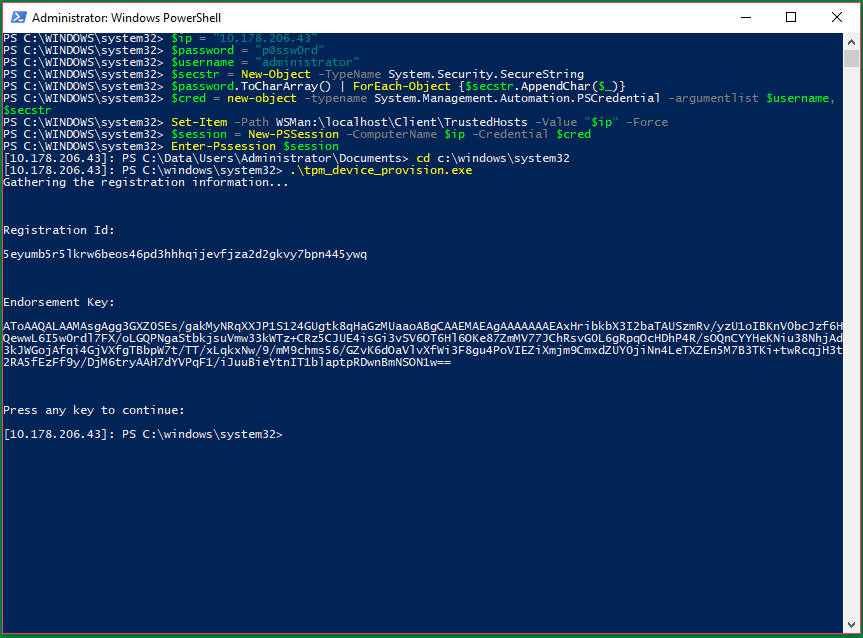

# IoT-Azure-Dps-Client

## Get from github
Clone recursively:

    git clone --recursive https://github.com/ms-iot/iot-azure-dps-client

If you find that the deps folder is empty, try this:

    git submodule update --init --recursive

## Set up development environment
Be sure you have CMAKE configured:

* Install [CMake](https://cmake.org/download/). 
* Make sure it is in your PATH by typing cmake -version from a command prompt. CMake will be used to create Visual Studio projects to build libraries and samples. 
* Make sure your CMake version is at least 3.6.1.

Be sure you have PERL configured:

* Install [perl](https://www.perl.org/get.html). You can use either ActivePerl or Strawberry Pearl. Run the installer as administrator to avoid issues.
    
Be sure you are using Visual Studio 2017 with Visual C++ (this last bit is important!)

## Build binaries for x86, ARM and X64

    Start a VS 2017 developer command prompt
    cd <repo>
    setup.cmd

## Setup Azure cloud resources

Setup cloud resources by following steps mentioned in https://docs.microsoft.com/en-us/azure/iot-dps/tutorial-set-up-cloud and gather below information.

    --ID Scope - You can get from Azure portal -> Device Provisioning Services -> Overview -> ID Scope.
    --Global device end point - You can get from Azure portal -> Device Provisioning Services -> Overview -> Global device endpoint.  

## Enroll the device in DPS
* Set up Windows IoT device with TPM by using the below link if you do not have already.
    https://developer.microsoft.com/en-us/windows/iot/getstarted

* Connect to device using PowerShell by using device administrator credentials from your development machine.

* Copy the provisioning tool (tpm_device_provision.exe built in the previous step) to Windows IoT device.
* Run provisioning tool from remote powershell connection.
    tpm_device_provision.exe
    Tool prints endorsement key and registration id, please note down.
  
  Here is the screenshot for reference,
  
  

* Enroll the device in DPS by following TPM based devices steps in the below link,
    https://docs.microsoft.com/en-us/azure/iot-dps/tutorial-provision-device-to-hub#enrolldevice

## Configure registry for IotDpsClient
The following information needs to be added to the registry:
* `TPM_SLOT`:   Logical slot in TPM to store the secrets. Valid values are from 0 to 9. Note down this, it will be needed for IOT DM client configuration.
* `DPS_URI`:    URI of DPS global device end point (Gathered during setup cloud resources) containing enrollment information of this device.
* `DPS_SCOPE`:  ID scope (Gathered during setup cloud resources) is assigned to a customer when they create the DPS in Azure portal.

To do this run below from remote PowerShell connection:
* reg add hklm\system\currentcontrolset\services\iotdpsclient\parameters  /v tpm_slot /t REG_SZ /d <TPM_SLOT>
* reg add hklm\system\currentcontrolset\services\iotdpsclient\parameters /v dps_uri /t REG_SZ /d <DPS_URI>
* reg add hklm\system\currentcontrolset\services\iotdpsclient\parameters /v dps_scope /t REG_SZ /d <DPS_SCOPE>

## Configure IotDpsClient
Copy the IotDpsClient.exe (IotDpsClient.exe built in the previous step) to Windows IoT device by using remote PowerShell connection.

Using one of the following options, register the device in IoTHub using the DPS client:

    Option 1: Run the console application from remote Powershell connection.
        IotDpsClient.exe -debug

    Option 2: Configure as service by running the below from remote PowerShell connection.
        IotDpsClient.exe -install
        cmd /c "sc config IotDpsClient start= auto"

## Managing the Windows IoT devices
* Click [here](<https://docs.microsoft.com/en-us/windows/iot-core/manage-your-device/azureiotdm>) to learn more about Windows IoT device management using Azure IoT Hub 
* Click [here](<https://github.com/ms-iot/iot-core-azure-dm-client>) for Device Management(DM) client library git repository.

## Verification

* Option 1: From the command line,

    	run "limpet <TPM_SLOT> -rur"
        It should display the service uri of the device, which confirms the device registered successfully in Azure IoT Hub.
	
    	run "limpet <TPM_SLOT> -ast"
        It should display the IotHub connection string of the device, which confirms the device registered successfully in Azure IoT Hub.

* Option 2: You can also use the Azure portal -> iothub device explorer and can find the device.

* Option 3: Use the [Device Management(DM) hello world application](<https://github.com/ms-iot/iot-core-azure-dm-client/blob/master/docs/dm-hello-world-overview.md>) for managing the device.

## Troubleshooting

If configuring the TPM is not successful for QCDB410C (Dragonboard), try following these steps to reset the TPM:

1. Unplug the board
1. Hold down the (|) and (+) button and power the board
1. Move the cursor with (-) and (+) to select "15. UEFI Menu" and confirm with (|)
1. Move the cursor with (-) and (+) to select "5. Clear UEFI BS Variables" and confirm with (|)
1. Move the cursor with (-) and (+) to select "6. Clear UEFI RT Variables and fTPM (Erase RPMB)" and confirm with (|)
1. Unplug the board
 

##########################################################################

## Setting up remote PowerShell connection
	Start the PowerShell by running as administrator in your development machine.
	$ip = "<Ip Address>"
	$password = "<administrator password>"
	$username = "administrator"
	$secstr = New-Object -TypeName System.Security.SecureString
	$password.ToCharArray() | ForEach-Object {$secstr.AppendChar($_)}
	$cred = new-object -typename System.Management.Automation.PSCredential -argumentlist $username, $secstr
	Set-Item -Path WSMan:\localhost\Client\TrustedHosts -Value "$ip" -Force
	$session = New-PSSession -ComputerName $ip -Credential $cred
	Enter-Pssession $session

    If you are having trouble using remote PowerShell connection see https://developer.microsoft.com/en-us/windows/iot/docs/powershell

## Learn more about Azure device provisioning service
* [Blog](<https://azure.microsoft.com/de-de/blog/azure-iot-hub-device-provisioning-service-preview-automates-device-connection-configuration/>)
* [Documentation](<https://docs.microsoft.com/en-us/azure/iot-dps/>)
* [Service SDK (preview release)](<https://www.nuget.org/packages/Microsoft.Azure.Devices/>)
* [Device SDK](<https://github.com/Azure/azure-iot-sdk-c>)
